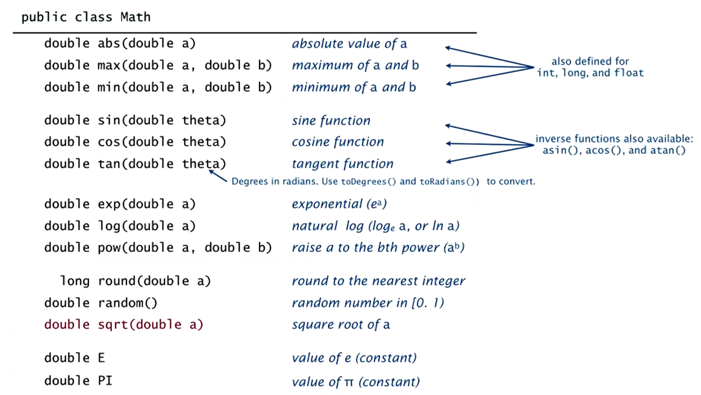

# Data Types

+ What is a Data Type? <br>
  + A set of values and a set of operations on those values

## Data Types in Java

- **char** (characters)
- **String** (sequences of characters)
- **int** (integers - `numbers`)
- **double** (floating-point numbers `eg.: 3.1415`)
- **boolean** (true/false values)

## Variables

A `variable` is a name that refers to a value. <br>
A `literal` is a programming-language representation of a value. <br>
A `declaration statement` associate a variable with a type. <br>
An `assignment statement` associates a value with a variable.

## Input and Output

is necessary for us to provide data to our programs and to learn the result of computations.

- Output
    - `System.out.println()` method prints the given string
    - Java automatically converts numbers to strings for output

- Command-line input
    - Strings you type afer the program name are available as `args[0]`, `args[1]`, ... at run time
      
  *How do we give an integer as command-line input?*
    - We need to call system method `Integer.parseInt()` to convert the string to integers.

### Data type for computing with integers: int

Values for `ints` are between `-2³¹` and `2³¹ - 1`

### Doubles

Values for `double` are real numbers and approximations (`eg.: 3.1415`) <br>
There are lots of built-in functions we can use to compute double values:

<!-- ``` 
public class Math
    double abs (double a)                 absolute value of a     | aslo defined
    double max (double a, double b)       maximum of a and b      | for int, long
    double min (double a, double b)       minimum of a and b      | and float

    double min (double theta)             sine function           | inverse functions:
    double cos (double theta)             cosine function         | asin(), acos(),
    double tan (double theta)             tangent function        | and atan()
                  ↳ Degrees in radians. Use toDegrees() and toRadians() to convert. 

``` -->
 

## Type Conversion with built-in types

Type conversion is an essential aspect of programming.

### Automatic
- Convert number to string for "+". `(concatenation)`
- Make numeric types match if no loss of precision. 
```java
expression        type    value
  11 * 2     →   double    2.75
```

### Explicitly defined for function call
```java
    expression                  type    value
Integer.parseInt("123")   →      int     123
Math.round(2.71828)       →     long      3 
```

### Cast for values that belong to multiple types
- Ex: small integers can be short, int or long. 
- Ex: double values can be truncated to int values.

``` java
     expression                       type    value
int(2.718)                      →     int       2
(int)Math.round(2.71828)        →     int       2
11 * (int)0.25                  →     int       0 
```

### **Pay attention to the type of your data**
  - type conversion can give counterintuitive results but gets easier to understand with practice.

<br>

# Summary

A data type is a set of values and a set of operations on those values.

### Commonly-used built-in data types in Java
- `String`, for computing with `sequence of characters`, for input and output
-`int`, for computing with sequence of `integers`, for math calculations in programs
-`double`, for computing with `floating point numbers`, typically for science and math apps.
-`boolean`, for computing with `true` and `false`, for decision making in programs.

In **Java** you must:
- Declare the types of yout variables.
- Convert from one type fo another when necessary.
- Identify and resolve type errors in order to *compile* your code.

`Pay attention to the type of your data.` <br>
The Java compiler is your *friend*: it will help you identify and fix type errors in your code